# Nexum Capital - Database Schema

## Entity-Relationship Diagram

```mermaid
erDiagram
    tenants {
        uuid id PK
        citext slug UK
        string name
        boolean active
        jsonb metadata
    }

    users {
        integer id PK
        string email_address UK
        string password_digest
        uuid tenant_id FK
        uuid party_id FK
        string role
    }

    sessions {
        integer id PK
        integer user_id FK
        string ip_address
        string user_agent
    }

    api_access_tokens {
        uuid id PK
        uuid tenant_id FK
        integer user_id FK
        string name
        string token_identifier UK
        string token_digest
        string_array scopes
        datetime expires_at
        datetime revoked_at
        datetime last_used_at
        jsonb metadata
    }

    parties {
        uuid id PK
        uuid tenant_id FK
        string kind "HOSPITAL | SUPPLIER | PHYSICIAN_PF | LEGAL_ENTITY_PJ | FIDC | PLATFORM"
        string external_ref
        citext document_number "CPF(11) or CNPJ(14)"
        string legal_name
        string display_name
        boolean active
        jsonb metadata
    }

    physicians {
        uuid id PK
        uuid tenant_id FK
        uuid party_id FK
        string full_name
        citext email
        string phone
        string professional_registry
        boolean active
        jsonb metadata
    }

    physician_legal_entity_memberships {
        uuid id PK
        uuid tenant_id FK
        uuid physician_party_id FK
        uuid legal_entity_party_id FK
        string membership_role "ADMIN | MEMBER"
        string status "ACTIVE | INACTIVE"
        datetime joined_at
        datetime left_at
        jsonb metadata
    }

    physician_anticipation_authorizations {
        uuid id PK
        uuid tenant_id FK
        uuid legal_entity_party_id FK
        uuid granted_by_membership_id FK
        uuid beneficiary_physician_party_id FK
        string status "ACTIVE | REVOKED | EXPIRED"
        datetime valid_from
        datetime valid_until
        jsonb metadata
    }

    physician_cnpj_split_policies {
        uuid id PK
        uuid tenant_id FK
        uuid legal_entity_party_id FK
        string scope "SHARED_CNPJ"
        numeric_12_8 cnpj_share_rate "0-1"
        numeric_12_8 physician_share_rate "0-1"
        string status "ACTIVE | INACTIVE"
        datetime effective_from
        datetime effective_until
        jsonb metadata
    }

    receivable_kinds {
        uuid id PK
        uuid tenant_id FK
        string code UK
        string name
        string source_family "PHYSICIAN | SUPPLIER | OTHER"
        boolean active
        jsonb metadata
    }

    receivables {
        uuid id PK
        uuid tenant_id FK
        uuid receivable_kind_id FK
        uuid debtor_party_id FK
        uuid creditor_party_id FK
        uuid beneficiary_party_id FK
        string contract_reference
        string external_reference UK
        numeric_18_2 gross_amount "gt 0"
        char_3 currency "BRL only"
        datetime performed_at
        datetime due_at
        datetime cutoff_at
        string status "PERFORMED | ANTICIPATION_REQUESTED | FUNDED | SETTLED | CANCELLED"
        boolean active
        jsonb metadata
    }

    receivable_allocations {
        uuid id PK
        uuid tenant_id FK
        uuid receivable_id FK
        integer sequence
        uuid allocated_party_id FK
        uuid physician_party_id FK
        numeric_18_2 gross_amount "gte 0"
        numeric_18_2 tax_reserve_amount "gte 0"
        boolean eligible_for_anticipation
        string status "OPEN | SETTLED | CANCELLED"
        jsonb metadata
    }

    anticipation_requests {
        uuid id PK
        uuid tenant_id FK
        uuid receivable_id FK
        uuid receivable_allocation_id FK
        uuid requester_party_id FK
        string idempotency_key UK
        numeric_18_2 requested_amount "gt 0"
        numeric_12_8 discount_rate "gte 0"
        numeric_18_2 discount_amount "gte 0"
        numeric_18_2 net_amount "gt 0"
        string status "REQUESTED | APPROVED | FUNDED | SETTLED | CANCELLED | REJECTED"
        string channel "API | PORTAL | WEBHOOK | INTERNAL"
        datetime requested_at
        datetime funded_at
        datetime settled_at
        date settlement_target_date
        jsonb metadata
    }

    receivable_events {
        uuid id PK
        uuid tenant_id FK
        uuid receivable_id FK
        bigint sequence
        string event_type
        uuid actor_party_id FK
        string actor_role
        datetime occurred_at
        string request_id
        string prev_hash
        string event_hash UK
        jsonb payload
    }

    documents {
        uuid id PK
        uuid tenant_id FK
        uuid receivable_id FK
        uuid actor_party_id FK
        string document_type
        string signature_method
        string status "SIGNED | REVOKED | SUPERSEDED"
        string sha256 UK
        string storage_key
        datetime signed_at
        jsonb metadata
    }

    document_events {
        uuid id PK
        uuid tenant_id FK
        uuid document_id FK
        uuid receivable_id FK
        uuid actor_party_id FK
        string event_type
        datetime occurred_at
        string request_id
        jsonb payload
    }

    auth_challenges {
        uuid id PK
        uuid tenant_id FK
        uuid actor_party_id FK
        string purpose
        string delivery_channel "EMAIL | WHATSAPP"
        string destination_masked
        string code_digest
        string status "PENDING | VERIFIED | EXPIRED | CANCELLED"
        integer attempts "gte 0"
        integer max_attempts "gt 0"
        datetime expires_at
        datetime consumed_at
        string request_id
        string target_type
        uuid target_id
        jsonb metadata
    }

    action_ip_logs {
        uuid id PK
        uuid tenant_id FK
        uuid actor_party_id FK
        string action_type
        inet ip_address
        string user_agent
        string request_id
        string endpoint_path
        string http_method
        string channel "API | PORTAL | WORKER | WEBHOOK | ADMIN"
        string target_type
        uuid target_id
        boolean success
        datetime occurred_at
        jsonb metadata
    }

    outbox_events {
        uuid id PK
        uuid tenant_id FK
        string aggregate_type
        uuid aggregate_id
        string event_type
        string status "PENDING | SENT | FAILED | CANCELLED"
        integer attempts
        datetime next_attempt_at
        datetime sent_at
        string idempotency_key UK
        jsonb payload
    }

    receivable_statistics_daily {
        uuid id PK
        uuid tenant_id FK
        date stat_date
        uuid receivable_kind_id FK
        string metric_scope "GLOBAL | DEBTOR | CREDITOR | BENEFICIARY"
        uuid scope_party_id FK
        bigint receivable_count
        numeric_18_2 gross_amount
        bigint anticipated_count
        numeric_18_2 anticipated_amount
        bigint settled_count
        numeric_18_2 settled_amount
        datetime last_computed_at
    }

    %% ── Tenant relationships ──
    tenants ||--o{ users : "has many"
    tenants ||--o{ parties : "has many"
    tenants ||--o{ receivable_kinds : "has many"
    tenants ||--o{ receivables : "has many"
    tenants ||--o{ api_access_tokens : "has many"

    %% ── Auth ──
    users ||--o{ sessions : "has many"
    users }o--o| parties : "optionally linked"
    users ||--o{ api_access_tokens : "has many"

    %% ── Identity ──
    parties ||--o| physicians : "is a"
    parties ||--o{ physician_legal_entity_memberships : "physician belongs to PJ"
    parties ||--o{ physician_legal_entity_memberships : "PJ has members"
    parties ||--o{ physician_anticipation_authorizations : "PJ grants"
    parties ||--o{ physician_anticipation_authorizations : "physician benefits"
    physician_legal_entity_memberships ||--o{ physician_anticipation_authorizations : "granted by"
    parties ||--o{ physician_cnpj_split_policies : "PJ split config"

    %% ── Receivables core ──
    receivable_kinds ||--o{ receivables : "categorizes"
    parties ||--o{ receivables : "debtor"
    parties ||--o{ receivables : "creditor"
    parties ||--o{ receivables : "beneficiary"

    %% ── Allocations & Anticipation ──
    receivables ||--o{ receivable_allocations : "split into"
    parties ||--o{ receivable_allocations : "allocated to"
    receivables ||--o{ anticipation_requests : "requested for"
    receivable_allocations ||--o{ anticipation_requests : "requested from allocation"
    parties ||--o{ anticipation_requests : "requester"

    %% ── Audit & Events (append-only) ──
    receivables ||--o{ receivable_events : "audit trail"
    parties ||--o{ receivable_events : "actor"

    %% ── Documents ──
    receivables ||--o{ documents : "contract evidence"
    parties ||--o{ documents : "signer"
    documents ||--o{ document_events : "lifecycle"

    %% ── Security & Compliance ──
    parties ||--o{ auth_challenges : "challenged"
    parties ||--o{ action_ip_logs : "acted"

    %% ── Projections ──
    receivable_kinds ||--o{ receivable_statistics_daily : "aggregated by"
    parties ||--o{ receivable_statistics_daily : "scoped to"
```



## Domain Clusters

```
 IDENTITY & AUTH               RECEIVABLES CORE              AUDIT & COMPLIANCE
 ─────────────────             ──────────────────            ──────────────────────
 ┌──────────────┐              ┌──────────────────┐          ┌─────────────────────┐
 │   tenants    │──────────────│ receivable_kinds  │          │ receivable_events   │
 └──────┬───────┘              └────────┬─────────┘          │  (append-only)      │
        │                               │                    └─────────────────────┘
 ┌──────┴───────┐              ┌────────┴─────────┐          ┌─────────────────────┐
 │    users     │              │   receivables     │──────────│ document_events     │
 │  (Argon2id)  │              │  (BRL, NUMERIC)   │          │  (append-only)      │
 └──────┬───────┘              └────────┬─────────┘          └─────────────────────┘
        │                          ┌────┴────┐               ┌─────────────────────┐
 ┌──────┴───────┐           ┌──────┴──┐  ┌───┴──────┐       │ action_ip_logs      │
 │  sessions    │           │allocat- │  │documents │       │  (append-only)      │
 └──────────────┘           │  ions   │  │(SHA-256) │       └─────────────────────┘
                            └────┬────┘  └──────────┘        ┌─────────────────────┐
 ┌──────────────┐                │                           │ outbox_events       │
 │api_access_   │           ┌────┴──────────┐                │  (append-only)      │
 │  tokens      │           │ anticipation_ │                └─────────────────────┘
 └──────────────┘           │  requests     │
                            │(idempotent)   │
 ┌──────────────┐           └───────────────┘
 │   parties    │
 │ (CPF/CNPJ)  │           PHYSICIAN MODEL                   PROJECTIONS
 └──────┬───────┘           ──────────────────               ──────────────────────
        │                   ┌──────────────────┐             ┌─────────────────────┐
 ┌──────┴───────┐           │   physicians     │             │receivable_statistics│
 │ physicians   │           └────────┬─────────┘             │     _daily          │
 └──────────────┘                    │                       └─────────────────────┘
                            ┌────────┴─────────┐
 SECURITY                   │  memberships     │              ┌────────────────────┐
 ─────────────────          │  (PF ↔ PJ)       │              │  auth_challenges   │
 ┌──────────────┐           └────────┬─────────┘              │ (EMAIL/WHATSAPP)   │
 │auth_challenges│                   │                        └────────────────────┘
 └──────────────┘           ┌────────┴─────────┐
                            │ anticipation_    │
                            │ authorizations   │
                            └──────────────────┘
                            ┌──────────────────┐
                            │cnpj_split_       │
                            │  policies        │
                            └──────────────────┘
```

## Table Summary

| # | Table | Purpose | RLS | Append-Only |
|---|-------|---------|-----|-------------|
| 1 | `tenants` | Multi-tenancy root | Yes | No |
| 2 | `users` | Web/portal authentication (Argon2id) | Yes | No |
| 3 | `sessions` | User web sessions | Yes | No |
| 4 | `api_access_tokens` | First-party API tokens | Yes | No |
| 5 | `parties` | Unified identity (hospitals, physicians, suppliers, FIDC) | Yes | No |
| 6 | `physicians` | Physician individual profiles | Yes | No |
| 7 | `physician_legal_entity_memberships` | PJ multi-physician relationships | Yes | No |
| 8 | `physician_anticipation_authorizations` | Physician-to-physician authorization delegation | Yes | No |
| 9 | `physician_cnpj_split_policies` | PJ receivable split configuration | Yes | No |
| 10 | `receivable_kinds` | Pluggable receivable type definitions | Yes | No |
| 11 | `receivables` | Core financial instrument | Yes | No |
| 12 | `receivable_allocations` | Multi-party split of receivables | Yes | No |
| 13 | `anticipation_requests` | Anticipation request lifecycle (idempotent) | Yes | No |
| 14 | `receivable_events` | Full receivable audit trail (hash-chained) | Yes | **Yes** |
| 15 | `documents` | Signed contract evidence (SHA-256) | Yes | No |
| 16 | `document_events` | Document lifecycle audit | Yes | **Yes** |
| 17 | `auth_challenges` | Email/WhatsApp confirmation codes | Yes | No |
| 18 | `action_ip_logs` | IP-tracked action audit trail | Yes | **Yes** |
| 19 | `outbox_events` | Integration outbox pattern | Yes | **Yes** |
| 20 | `receivable_statistics_daily` | Daily metrics projection/read model | Yes | No |

## Key Constraints

### Financial Precision
- All monetary amounts: `NUMERIC(18,2)` -- never float
- All rates: `NUMERIC(12,8)`
- Currency locked to `BRL` via DB constraint
- Split policies enforce `cnpj_share + physician_share = 1.00000000`

### Security
- **RLS on all 20 tables** with `FORCE ROW LEVEL SECURITY`
- Session context required: `SET LOCAL app.tenant_id`, `app.actor_id`, `app.role`
- Append-only tables enforced via `app_forbid_mutation()` trigger (raises exception on UPDATE/DELETE)
- Corrections via compensating events only

### Idempotency
- `anticipation_requests.idempotency_key` -- unique per tenant
- `outbox_events.idempotency_key` -- unique per tenant
- `receivable_events` -- hash-chained (`prev_hash` -> `event_hash`)
